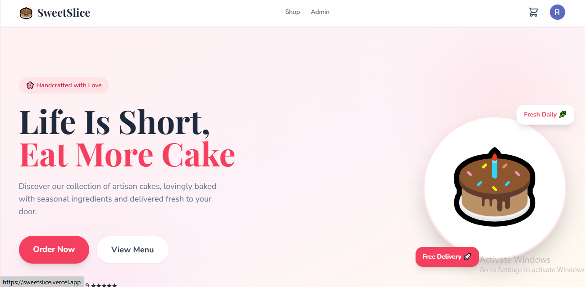
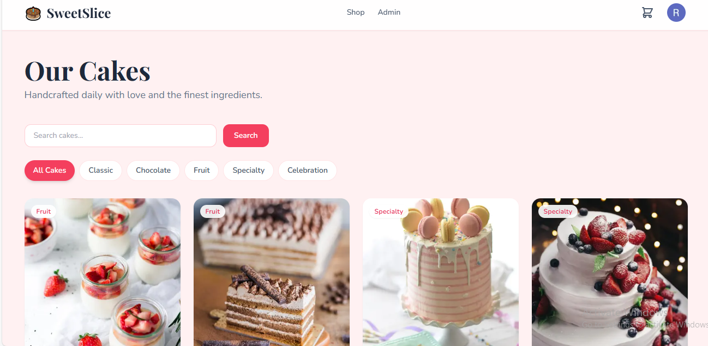
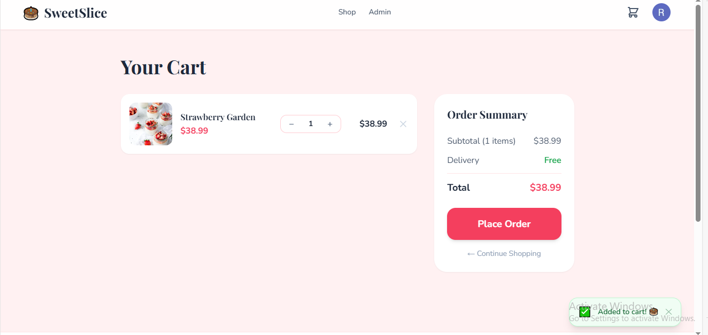

# 🎂 SweetSlice — Cake Shop E-Commerce

A full-stack e-commerce web application for an artisan cake shop, built as a portfolio project.

## 🚀 Live Demo
👉 [View Live App](https://sweetslice.vercel.app)

## 📸 Screenshots

### Homepage


### Shop Page


### Cart


## 🛠 Tech Stack
- **Next.js 14** (App Router)
- **Supabase** (Google OAuth + PostgreSQL + Realtime)
- **Tailwind CSS**
- **TypeScript**
- **Vercel** (Deployment)

## ✨ Features
- Google OAuth authentication
- Product catalog with category filtering and search
- Real-time cart sync across browser tabs
- Order management with history
- Admin dashboard for product and order management
- Fully responsive mobile-first UI
- Loading skeletons and toast notifications

## 📁 Project Structure
```
sweetslice/
├── app/              # Next.js App Router pages
│   ├── shop/         # Product listing
│   ├── product/[id]/ # Product detail
│   ├── cart/         # Shopping cart
│   ├── orders/       # Order history
│   └── admin/        # Admin dashboard
├── components/       # Reusable UI components
├── lib/              # Supabase clients and hooks
└── utils/            # Helper functions
```

## 🗄 Database Schema
- **products** — Cake listings with stock management
- **cart_items** — User cart with realtime sync
- **orders** — Order records with status tracking
- **order_items** — Individual items per order

## 👤 Author
**Rachana Poojari**
- GitHub: [@Rachhp](https://github.com/Rachhp)
- Email: rachanapoojari2000@gmail.com